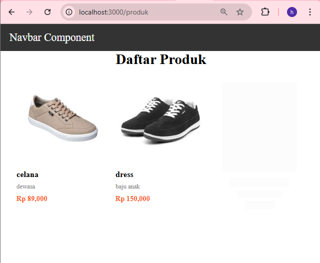

Bagian 1 – Setup Data Produk
Bagian 2 – Implementasi CSR dengan useEffect
    Modifikasi index.tsx
        
    Modifikasi index.tsx pada pages/produk/
        
    Jalankan browser http://localhost:3000/produk
        
    Modifikasi produk.modules.scss
        
    Modifikasi Pada file index.tsx pada folder pages/views/product
        
    Jalankan Browser
        
Bagian 3 – Implementasi Skeleton Loading
    Modfikasi file index.tsx pada folder views/product/index.tsx
        
    Modifikasi file product.module.scss
        
    Jalankan browser
        
    Modifikasi pada index.tsx pada folder views/product/index.tsx
        
    Jalankan browser
        
Bagian 5 – Implementasi SWR
    https://swr.vercel.app/
    Install SWR
    Buka dan modifkasi file index.tsx pada folder pages/product/
    Modifikasi file fetcher.ts
    Modifikasi file index.tsx pada folder pages/produk

Tugas Praktikum
Tugas Individu
1. Jelaskan perbedaan:
    o Client Side Rendering
    o Server Side Rendering
    o Static Site Generation
2. Buat halaman produk dengan:
    o Skeleton loading
    o Animasi
3. Refactor kode dari useEffect menjadi SWR.

type ProductType = {
    id: string;
    name: string;
    price: number;
    image: string;
    category: string;
};

const TampilanProduk = ({products}: { products: ProductType[] }) => {
    return (
        

            <h1>Daftar Produk</h1>

            {products.map((products: ProductType) => (
                

                    <h2>nama :{products.name}</h2>
                    
Harga: {products.price}

                    
                    
Kategori: {products.category}

                

            ))}
        

    );
};

export default TampilanProduk;

import { useEffect, useState } from "react";
import  TampilanProduk from "../views/product";

const kategori = () => {
  const [products, setProducts] = useState([]);
  // const [loading, setLoading] = useState(false);
  // const fetchProducts = async () => {
  //   try {
  //     setLoading(true);
  //     const response = await fetch("/api/produk");
  //     const responsedata = await response.json();
  //     setProducts(responsedata.data);
  //   } catch (error) {
  //     console.error("Error fetching products:", error);
  //   } finally {
  //     setLoading(false);
  //   }
  // };
  useEffect(() => {
    fetch("/api/produk")
      .then((response) => response.json())
      .then((responsedata) => {
        setProducts(responsedata.data);
  })
  .catch((error) => {
    console.error("Error fetching products:", error);
  });
  }, []);
  return (
    

      <TampilanProduk products={products} />
    

  );
};

export default kategori;