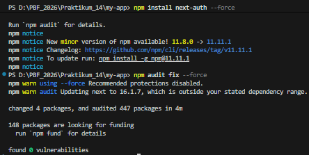
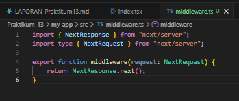
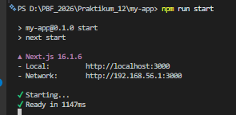
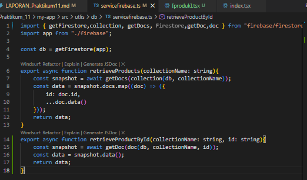
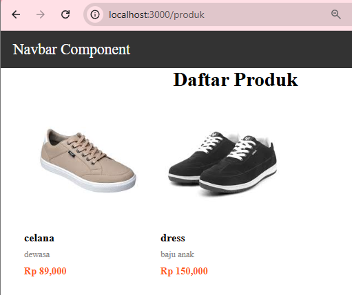
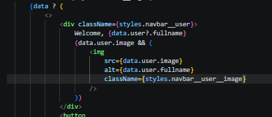
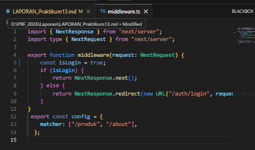
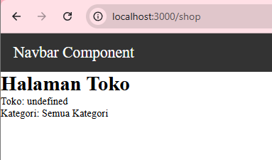
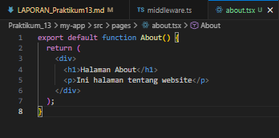

Bagian 1 – Membuat Middleware
    Modifikasi file index.tsx pada folder src/pages/produk
    
Bagian 2 – Struktur Dasar Middleware
    
Bagian 3 – Redirect Sederhana
    
Bagian 4 – Batasi Route Tertentu
    
Bagian 5 – Simulasi Sistem Login
    
    User diarahkan ke page Login ketika mengakses http://localhost:3000/auth/login
    

    Pengujian

Uji 1 – isLogin = false
    Akses:
        /products
        
    Hasil:
        Redirect ke /login

Uji 2 – isLogin = true
    Ubah:
        const isLogin = true
        
    Hasil:
        Bisa mengakses /products
        
Uji 3 – Tambahkan Multiple Route
    export const config = {
    matcher: ['/products', '/about']
    }
    Sekarang:
    • /products dan /about butuh login
    • Halaman lain bebas
    

Kode file about.tsx
    

KESIMPULAN: 
    Pada praktikum ini dibuat beberapa halaman pada aplikasi Next.js, yaitu halaman /products, /about, dan /login di dalam folder pages. Setiap file yang dibuat secara otomatis menjadi route yang dapat diakses melalui browser.

    Selanjutnya diimplementasikan middleware untuk mengatur akses ke halaman tertentu. Middleware memeriksa kondisi login menggunakan variabel isLogin. Jika isLogin bernilai false, maka pengguna akan diarahkan ke halaman /login. Jika isLogin bernilai true, maka pengguna dapat mengakses halaman yang dituju.

    Proteksi hanya diterapkan pada route /products dan /about menggunakan konfigurasi matcher. Berdasarkan pengujian, ketika pengguna belum login dan mencoba membuka halaman tersebut, sistem akan otomatis melakukan redirect ke halaman /login.

    Middleware melakukan pengecekan login sebelum halaman dimuat, sehingga pengguna yang belum login langsung diarahkan ke halaman /login tanpa melihat isi halaman terlebih dahulu. Sedangkan useEffect melakukan pengecekan setelah halaman dimuat di browser, sehingga halaman sempat tampil sebentar sebelum akhirnya diarahkan ke halaman login. Oleh karena itu, middleware lebih aman dan lebih efisien digunakan untuk melindungi route tertentu.

PERTANYAAN ANALISIS: 
1. Mengapa middleware lebih aman dibanding useEffect?
    Karena middleware berjalan di server sebelum halaman dimuat, sehingga pengguna yang belum login tidak bisa mengakses halaman sama sekali. Sedangkan useEffect berjalan di client setelah halaman dimuat.

2. Mengapa middleware tidak menimbulkan glitch?
    Karena pengecekan dilakukan sebelum halaman ditampilkan, sehingga tidak terjadi tampilan halaman sebentar sebelum redirect.

3. Apa risiko jika semua halaman diproteksi tanpa pengecualian?
    Pengguna bisa tidak dapat mengakses halaman penting seperti login atau halaman utama, sehingga dapat menyebabkan redirect terus-menerus (redirect loop).

4. Kapan middleware tidak diperlukan?
    Middleware tidak diperlukan jika halaman tidak memerlukan autentikasi atau pembatasan akses, misalnya halaman informasi umum.

5. Apa perbedaan middleware dan API route?
    Middleware digunakan untuk mengontrol request sebelum halaman diakses (misalnya autentikasi atau redirect). Sedangkan API route digunakan untuk menjalankan logika backend dan mengembalikan data ke client.