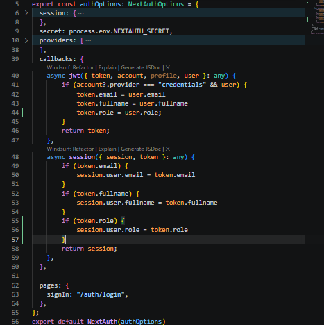
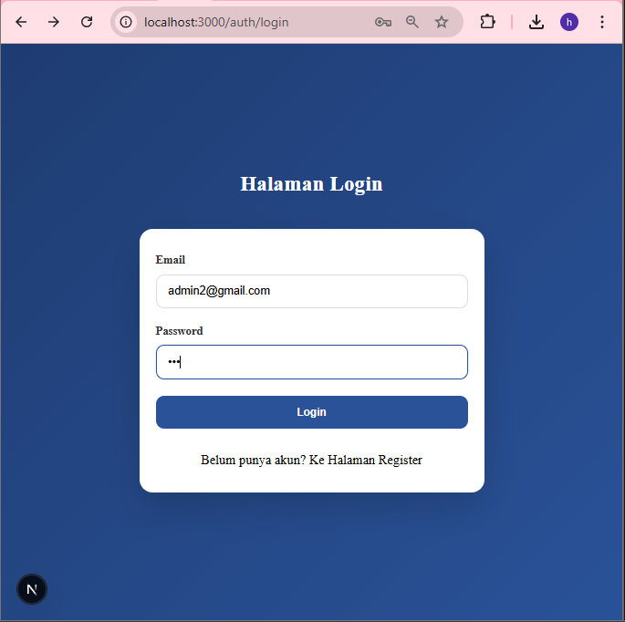

Langkah Praktikum

BAGIAN 1 – Custom Login Page
    Tambahkan custom page di NextAuth line 55-57
        
    • Jalankan browser http://localhost:3000/ dan klik sign in maka akan diarahkan ke
    login
        
BAGIAN 2 – Handle Login di Frontend
    • Copy paste isi dari register/index.tsx ke file login/index.tsx
        
    • Copy paste isi dari register/register.module.scss ke file login/login.module.scss
        
    • Semua text register pada file index.tsx pada folder login diubah menjadi login
        
    • Jalankan browser localhost:3000/auth/login. Tampilannya akan sama dengan register
        
    • Buka file index.tsx pada folder views/auth/login dan modifikasi codenya seperti
    berikut
        
    • Buka file servicefirebase.ts dan tambahkan code di line 25-38
        
BAGIAN 3 – Authorize di NextAuth (Database Login)
    • Buka file [...nextauth].ts modifikasi menjadi berikut ( pada bagian providers )
        
BAGIAN 4 – Tambahkan Role ke Token
    • JWT Callback pada file [...nextauth].ts Modifikasi menjadi
        
    • Jalankan browser http://localhost:3000/auth/login
        
        
BAGIAN 5 – Callback URL Logic
    • Modifikasi withAuth.ts pada folder src/middleware
BAGIAN 6 – Membuat halaman Admin dan authoriz
    • Buat halaman admin

    • Pada index.tsx tambahkan code berikut

    • Modifikasi withAuth.ts

    • Jalankan browser localhost:3000/produk dan pada status sudah login. Rubah urlnya
    menjadi http://localhost:3000/admin maka user akan diarahkan ke localhost. Pada
    intinya role selain admin tidak bisa mengakses
    • Untuk mencoba halaman admin rubah role pada firebas pada salah satu akun dan
    jalankan http://localhost:3000/admin