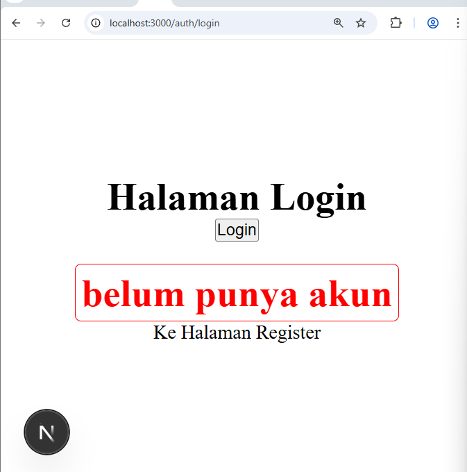
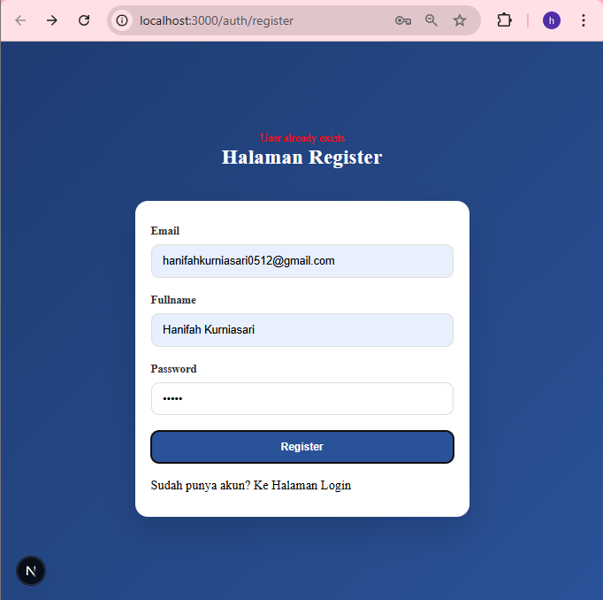
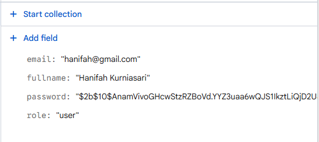
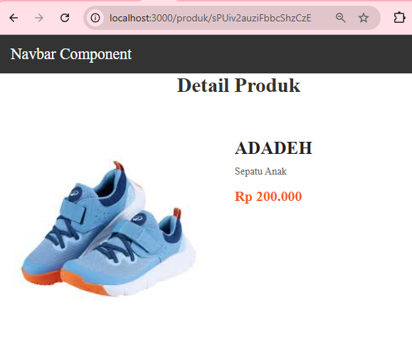
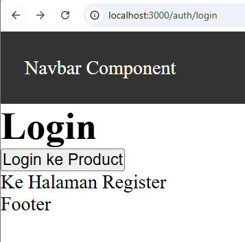
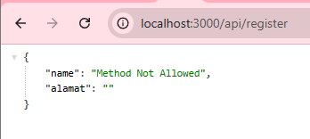
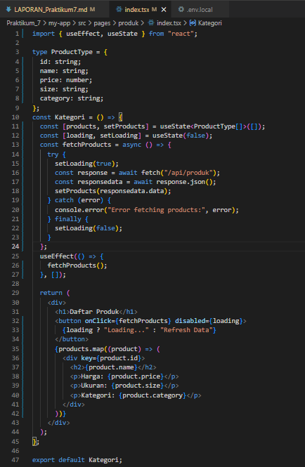
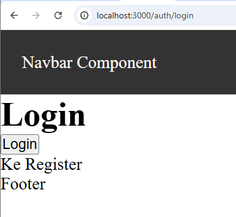
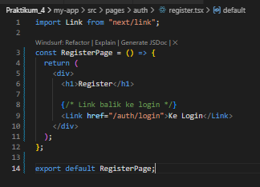

LAPORAN PRAKTIKUM 3

1. Routing Dasar (Static Routing)
    
2. Routing Menggunakan Folder
    
    Hasil dari halaman browser tetap sama tetapi lebih rapi
3. Nested Routing
    
    
    
    
4. Dynamic Routing 
    => Modifikasi index.tsx 
        
    => Modifikasi [id].tsx
        cek menggunakan console.log
        ![[id].tsx](image-5.png)
    => Modifikasi [id].tsx agar dapat mengambil nilai dari id 
        ![modifikasi [id].tsx](image-8.png)
    => Uji di Browser
        -/produk/sepatu-baru
        
        -/produk/baju
        
5. Membuat Komponen Navbar 
    
        => Modifikasi index.tsx
            
        => Modifikasi _app.tsx
            
        => Hasil
            
            
            
6. Membuat Layout Global (App Shell)
    
    
7. Implementasi Layout di _app.tsx
    => Modifiaksi _app.tsx
        
        

E. Tugas Praktikum 
    Tugas 1 – Routing 
        1. Buat halaman: 
            o /profile 
                
            o /profile/edit 
                
        2. Pastikan routing berjalan tanpa error
            Hasil tidak error 
    Tugas 2 – Dynamic Routing 
        1. Buat routing: 
        2. /blog/[slug] 
        3. Tampilkan nilai slug di halaman 
        
    Tugas 3 – Layout 
        1. Tambahkan Footer pada AppShell 
        Modifikasi index.tsx dan _app.tsx
            
            
        2. Footer tampil di semua halaman 
        hasil:
            
            
            
            
F. Pertanyaan Refleksi 
    1. Apa perbedaan routing berbasis file dan routing manual? 
        Routing berbasis file:
            - URL otomatis dibuat dari struktur folder
            - Tidak perlu konfigurasi route
            - Lebih sederhana dan cepat
        Routing manual:
            - Harus mendefinisikan route satu per satu
            - Biasanya pakai library seperti React Router
            - Lebih fleksibel tapi lebih kompleks
    2. Mengapa dynamic routing penting dalam aplikasi web? 
        Karena:
            - Memungkinkan satu file menangani banyak URL
            - Cocok untuk data dinamis 
            - Tidak perlu buat file satu per satu
    3. Apa keuntungan menggunakan layout global dibanding memanggil komponen satu per satu? 
    Navbar & Footer cukup ditulis sekali
        1. Konsisten di semua halaman
        2. Tidak perlu import satu per satu
        3. Kode lebih rapi dan mudah dirawat
