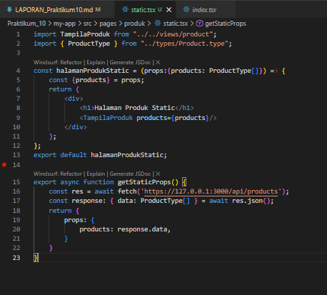
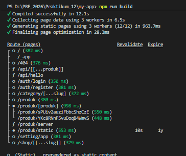
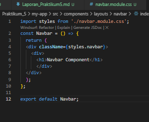
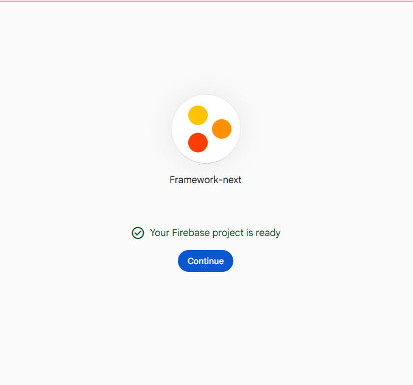
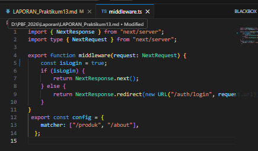
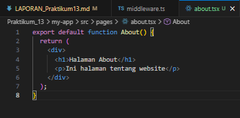
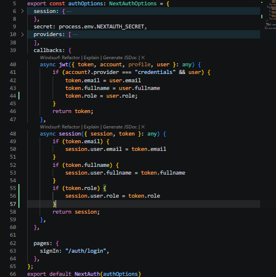

1. Routing Dasar (Static Routing)
    
2. Routing Menggunakan Folder
    
    Hasil dari halaman browser tetap sama tetapi lebih rapi
3. Nested Routing
    
    
    
    
4. Dynamic Routing 
    => Modifikasi index.tsx 
        
    => Modifikasi [id].tsx
        cek menggunakan console.log
        ![[id].tsx](image-5.png)
    => Modifikasi [id].tsx agar dapat mengambil nilai dari id 
        ![modifikasi [id].tsx](image-8.png)
    => Uji di Browser
        -/produk/sepatu-baru
        
        -/produk/baju
        
5. Membuat Komponen Navbar 
    

