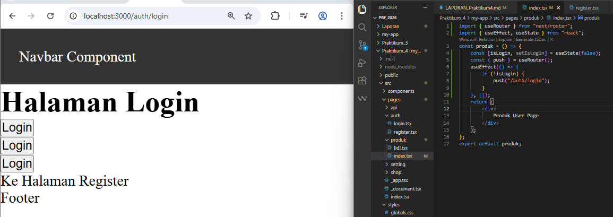

Langkah 1 – Menjalankan Project
    
Langkah 2 – Membuat Catch-All Route 
    
    
Langkah 3 – Pengujian Catch-All Route 
    
    Berapapun banyaknya seqment tetap terbaca 
Langkah 4 – Optional Catch-All Route
    
    Halaman dapat diakses meskipun tanpa parameter. 
Langkah 5 – Validasi Parameter
    Tambahkan validasi agar tidak error saat slug kosong:
    
Langkah 6 – Membuat Halaman Login & Register
    
Langkah 7 – Navigasi Imperatif (router.push)
    
     klik button login maka akan menuju /produk 
    
Langkah 8 – Simulasi Redirect (Belum Login)
    