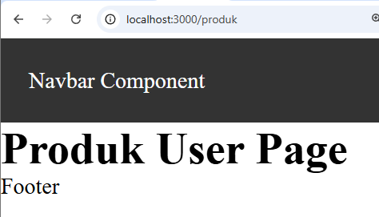
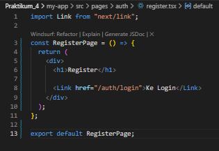
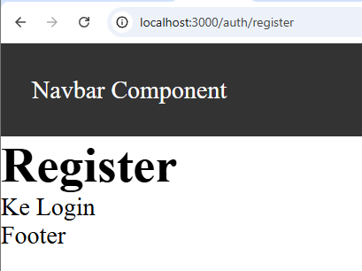

LANGKAH PRAKTIKUM

Langkah 1 – Menjalankan Project
    
Langkah 2 – Membuat Catch-All Route 
    
    
Langkah 3 – Pengujian Catch-All Route 
    
    Berapapun banyaknya seqment tetap terbaca 
Langkah 4 – Optional Catch-All Route
    
    Halaman dapat diakses meskipun tanpa parameter. 
Langkah 5 – Validasi Parameter
    Tambahkan validasi agar tidak error saat slug kosong:
    
Langkah 6 – Membuat Halaman Login & Register
    
Langkah 7 – Navigasi Imperatif (router.push)
    
     klik button login maka akan menuju /produk 
    
Langkah 8 – Simulasi Redirect (Belum Login)
    

TUGAS PRAKTIKUM

Tugas 1 (Wajib) 
    • Buat catch-all route: 
    • /category/[...slug].js 
        
    • Tampilkan seluruh parameter URL dalam bentuk list. 
        
Tugas 2 (Wajib) 
    • Buat navigasi: 
        o Login → Product (imperatif)
            
            
            
        o Login ↔ Register (Link) 
            
            
Tugas 3 (Pengayaan) 
    • Terapkan redirect otomatis ke login jika user belum login.
         

F. Pertanyaan Evaluasi 
1. Apa perbedaan [id].js dan [...slug].js? 
    [id].js digunakan untuk menangkap satu parameter dinamis pada URL
    Sedangkan [...slug].js  dapat menangkap lebih dari satu parameter
2. Mengapa slug berbentuk array? 
    karena catch-all route ([...slug]) dapat menerima jumlah segmen URL yang tidak tetap
3. Kapan sebaiknya menggunakan Link dan router.push()? 
    Link digunakan ketika berpindah halaman melalui klik link biasa, seperti navigasi dari Login ke Register
    Sedangkan router.push() digunakan ketika navigasinya bersifat imperatif atau membutuhkan logika tertentu sebelum berpindah halaman, seperti setelah proses login berhasil, setelah submit form, atau untuk melakukan redirect otomatis
4. Mengapa navigasi Next.js tidak me-refresh halaman?
    Navigasi pada Next.js tidak me-refresh halaman karena menggunakan client-side routing.
    Artinya, perpindahan halaman dilakukan di sisi client (browser) tanpa memuat ulang seluruh halaman dari server sehingga lebih cepat dan responsif