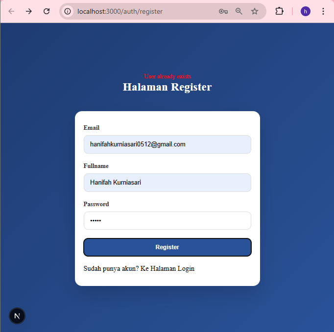
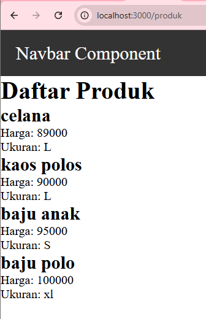
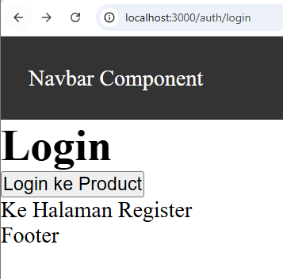
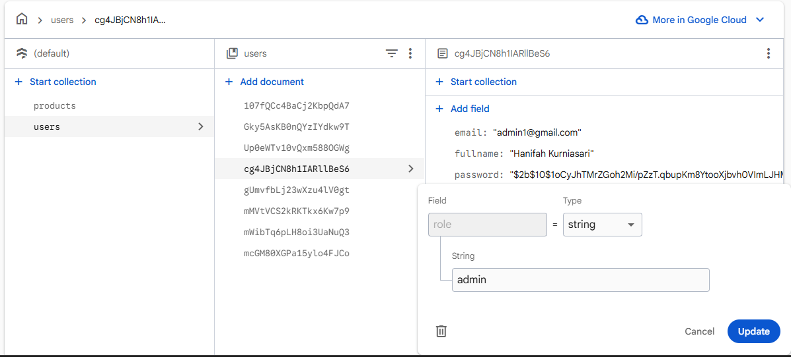
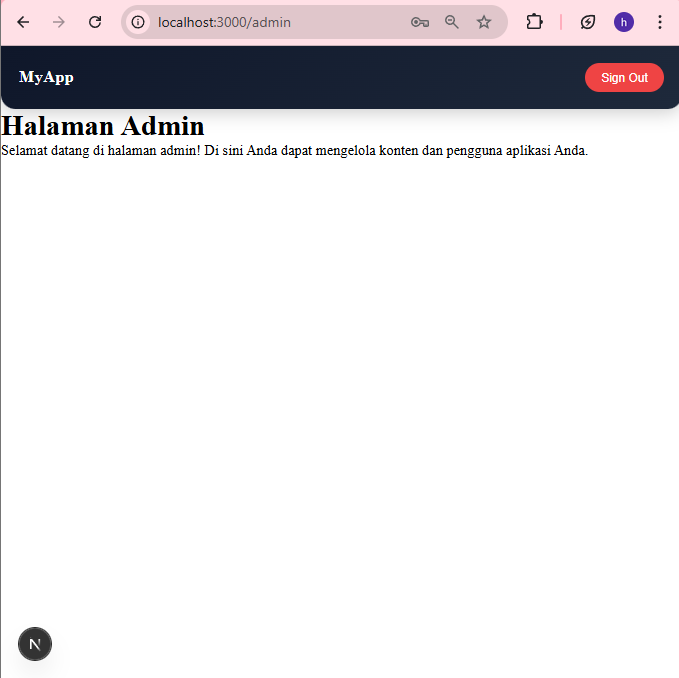
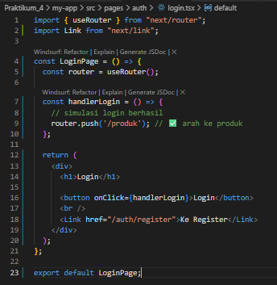
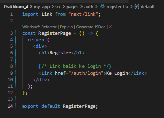
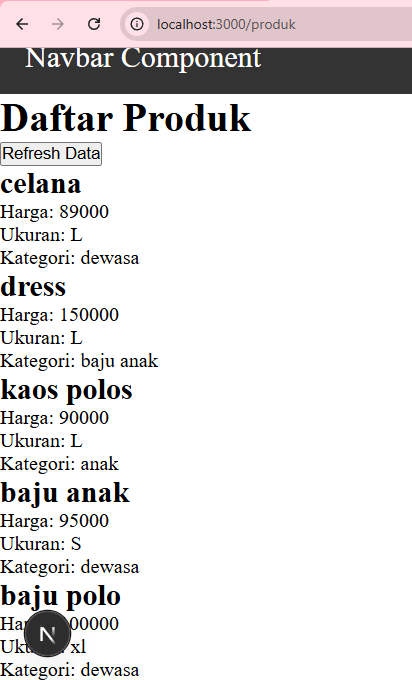

LANGKAH PRAKTIKUM

1. Global CSS
2. CSS Module (Local Scope)
    • Modifikasi global.css
        
    • Modifikasi navbar.module.css
        
    • Modifikasi kode pada index.tsx pada folder navbar
        
    • Jalankan browser
        
3. Styling untuk Pages (CSS Module)
    • Modifikasi login.module.css
        
    • Modifikasi login.tsx
        
    • Jalankan browser
        
4. Conditional Rendering Navbar (Tanpa Navbar di Login)
    • Modifikasi index.tsx pada folder Appsheel
        
    • Jalankan browser
        
5. Refactoring Struktur Project (Best Practice)
    • Modifikasi login.module.css pada folder view/auth/login/
        
    • Login.module.css pada folder pages/auth dihapus
    • Modifikasi login.tsx pada folder pages/auth
        
    • Modifikasi index.tsx pada folder views/auth/login
        
    • Jalankan browser
        
6. Inline Styling (CSS-in-JS)
    • Modifikasi index.tsx pada folder views/auth/login
        
    • Jalankan browser
        
7. Kombinasi Global CSS + CSS Module
    • Modifikasi global.css
        
    • Modifikasi index.tsx pada folder components/layouts/navbar
        
8. SCSS (SASS)
    
    • Modifikasi colors.scss
        
    • Modifikasi index.tsx
        
    • Modifikasi login.module.scss
        
    • Jalankan browser
        
9. Tailwind CSS
    • Modifikasi index.tsx pada folder auth/login/
        
    • Jalankan browser
        

TUGAS PRAKTIKUM

Tugas 1
• Buat halaman Register
• Gunakan CSS Module
Tugas 2
• Refactor halaman Produk ke folder views
• Pisahkan Hero Section dan Main Section
Tugas 3
• Terapkan Tailwind CSS
• Gunakan minimal 5 utility class

F. Pertanyaan Refleksi
1. Kapan sebaiknya menggunakan CSS Module dibanding Global CSS?
2. Apa kelemahan inline styling?
3. Mengapa SCSS cocok untuk project skala besar?
4. Apa keunggulan Tailwind dibanding CSS tradisional?

    