Langkah Praktikum
    Bagian 1 – Membuat Register View
        o Modifikasi file index.tsx ( pada folder views/auth/register/index.tsx)
            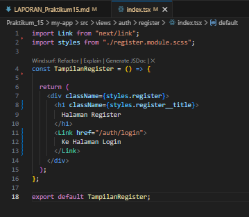
        o Modifikasi file register.tsx ( pada folder pages/auth/register.tsx )
            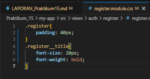
        o Modifikasi register.module.scss
            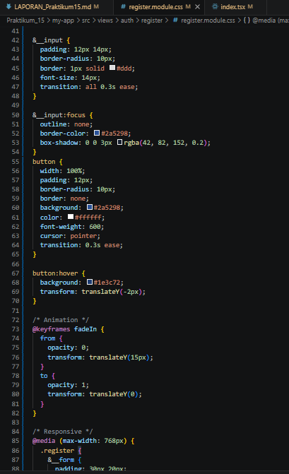
        o Tambahkan form inputan pada file index.tsx
            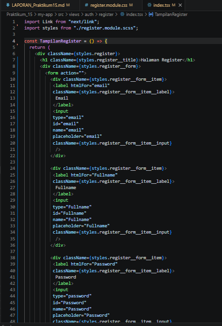
        o Modifikasi register.module.scss
        Jalankan browsernya http://localhost:3000/auth/register
            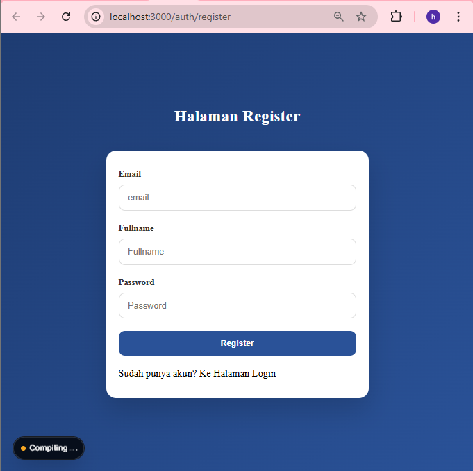

    Bagian 2 – Membuat API Register
        o Buka file servicefirebase.ts pada folder src/utils/db dan modifikasi
            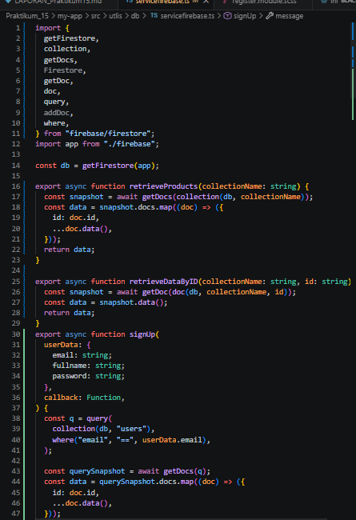
        o Modifikasi file register.ts
            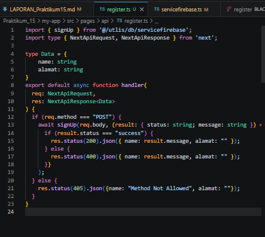
        o Modifikasi index.tsx pada folder register ( tambahkan beberapa code)
            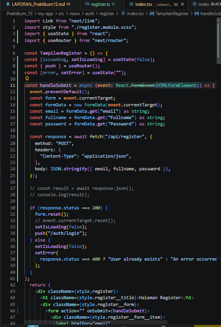
        o Buka browser http://localhost:3000/auth/register
            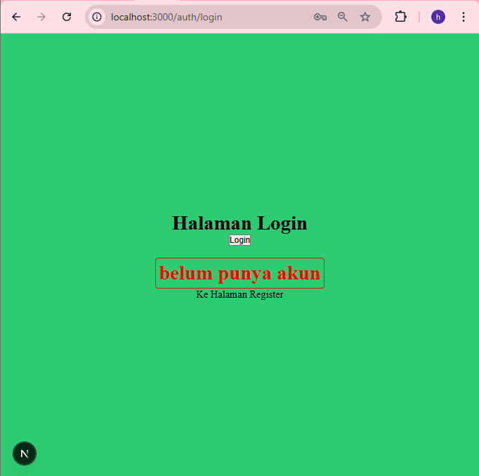
            -> setelah form diisi browser mengarah ke halaman login

    Bagian 3 – Install bcrypt
        • npm install bcrypt --force
        • npm install --save-dev @types/bcrypt –force
            
        • Buka file servicefirebase.ts pada folder src/utils/db dan modifikasi
            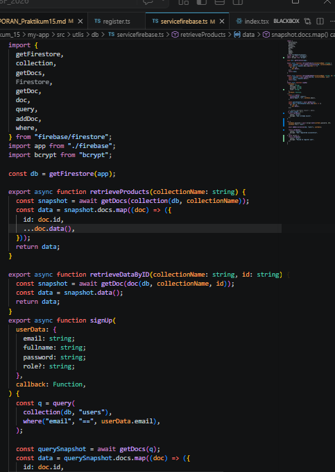
            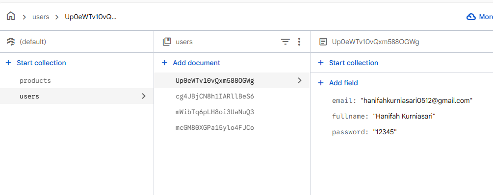
            -> Data user berhasil masuk ke firebase

        Namun saat memasukkan data yg sama tidak ada pemberitahuan pada
layar maka dari itu perlu ada perubahan pada code index.tsx
            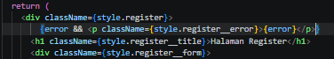
            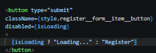
        • Modifikasi juga pada register.module.scss
            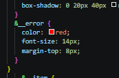
        • Jalankan browser http://localhost:3000/auth/register
            
                muncul norifikasi "User already exists" saat memasukkan data yang sudah pernah dipakai sebelumnya
        • Tambakan loading dengan menambahkan kode pada index.tsx
            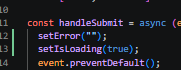
        • Jika berhasil maka hasilnya akan muncul loading saat klik register

Pengujian

    Uji 1 – Register Baru
    Input:
    • Email baru
    Hasil:
    • Data tersimpan di Firestore
    • Password ter-hash
    • Redirect ke login
        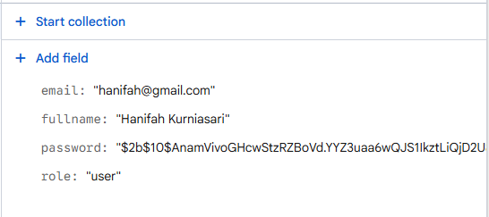

    Uji 2 – Email Sudah Ada
    Input:
    • Email yang sama
    Hasil:
    • Error 400
    • Message: Email already exists
        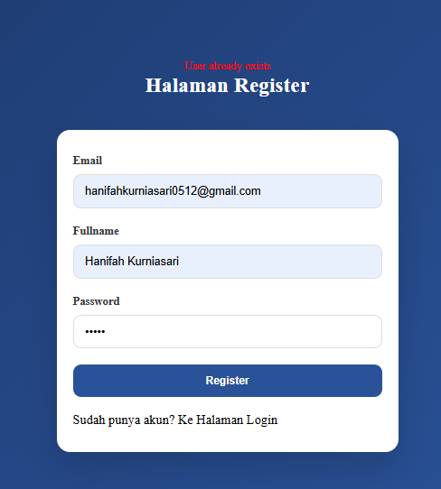

    Uji 3 – Method GET
    Akses:
    /api/register
        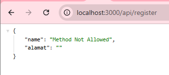
    Hasil:
    • 405 Method Not Allowed

Pertanyaan Analisis
1. Mengapa password harus di-hash?

Password harus di-hash agar tidak disimpan dalam bentuk asli (plain text) di database. Dengan hashing, jika database bocor, password pengguna tetap aman karena sulit dikembalikan ke bentuk aslinya

2. Apa perbedaan addDoc dan setDoc?
addDoc: digunakan untuk menambahkan data dengan ID otomatis dari Firestore.
setDoc: digunakan untuk menyimpan data dengan ID yang ditentukan sendiri

3. Mengapa perlu validasi method POST?

Validasi method POST diperlukan agar endpoint hanya menerima permintaan yang sesuai (misalnya untuk mengirim data) dan mencegah akses yang tidak diinginkan seperti GET, PUT, atau DELETE yang bisa menyebabkan error atau celah keamanan.

4. Apa risiko jika email tidak dicek unik?
bisa terjadi duplikasi akun
pengguna bisa bingung saat login
berpotensi terjadi masalah keamanan dan integritas data

5. Apa fungsi role pada user?

Role digunakan untuk menentukan hak akses pengguna dalam sistem, misal:
admin: bisa mengelola data
user: hanya bisa menggunakan fitur tertentu