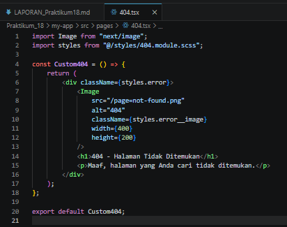
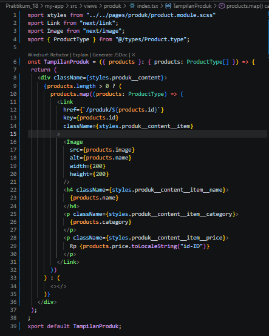
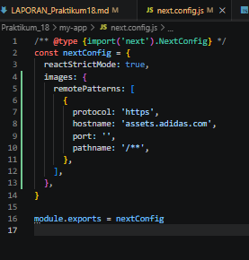
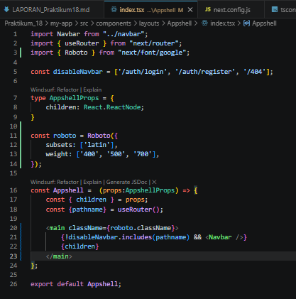
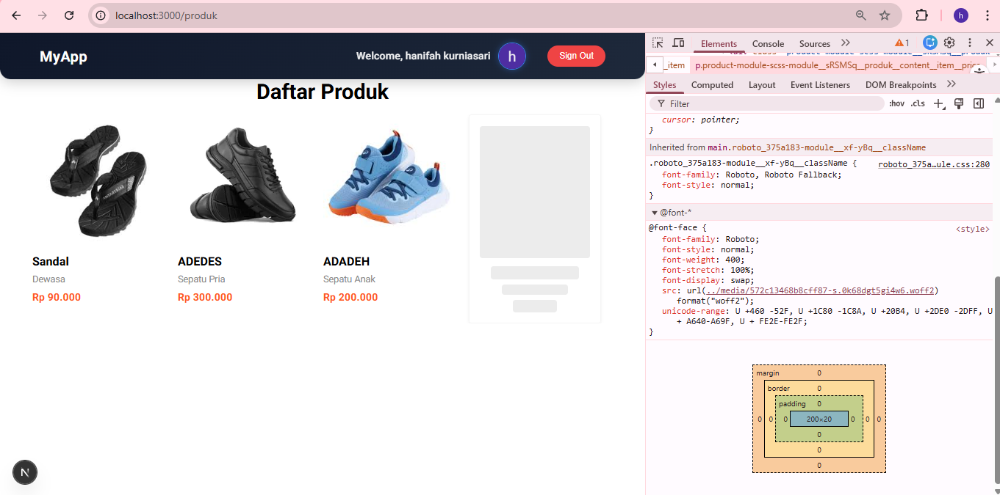
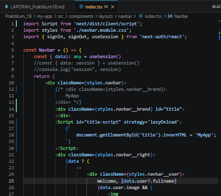
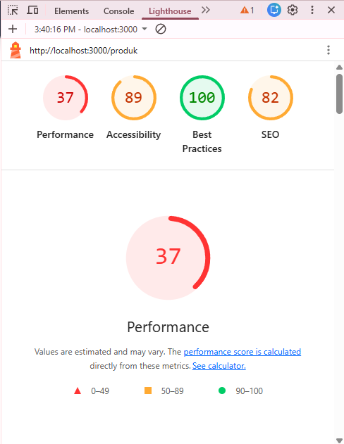

PRAKTIKUM 1 – Image Optimization

    A. Optimasi Gambar Lokal (Public Folder)
        o Mengganti tag  pada halaman 404 dengan next/image. Langkah:
            o Buka file src/pages/404.tsx
            o Modifikasi line 7 menjadi line 8-11
               
    B. Optimasi Gambar Remote (External URL)
        o Buka file views/product/index.tsx
        o Modifikasi file index.tsx
            
        Note : dikarenakan gambar diambil dari url tertentu maka konfigurasi berbeda
        o Buka file next.config.js
            
PRAKTIKUM 2 – Font Optimization
    A. Menggunakan next/font
        o Buka file index.tsx pada folder Appshell/index.tsx dan modifkasi
            
        o Jalankan browser localhost:3000/produk maka font akan berubah menjadi roboto
        untuk mengecek fontnya bisa menggunakan extension FontFinder
            
PRAKTIKUM 3 – Script Optimization
    B. Menggunakan next/script
        o Buka file index.tsx pada folder layouts/Navbar dan modifikasi
            
PRAKTIKUM 4 – Optimasi Avatar dengan next/image

    o Buka file index.tsx pada folder layouts/navbar dan modifikasi :

    o Tambahkan hostname Google:

1. Mengapa  biasa tidak optimal?

Tag  biasa tidak optimal karena tidak memiliki fitur optimasi otomatis. Berbeda dengan next/image,  tidak melakukan kompresi, lazy loading, maupun penyesuaian ukuran gambar berdasarkan perangkat pengguna. Akibatnya, gambar bisa menjadi lebih berat dan memperlambat waktu loading halaman.

2. Apa perbedaan font CDN dan next/font?

Font CDN mengambil font dari server eksternal (misalnya Google Fonts), sehingga membutuhkan request tambahan ke internet. Sedangkan next/font meng-host font secara lokal di aplikasi Next.js, sehingga lebih cepat, stabil, dan tidak bergantung pada koneksi eksternal.

3. Mengapa script bisa membuat website lambat?

Script dapat memperlambat website karena harus diunduh dan dijalankan oleh browser. Jika script terlalu banyak atau dijalankan di waktu yang tidak tepat, maka dapat menghambat rendering halaman. Hal ini menyebabkan waktu loading menjadi lebih lama dan menurunkan performa.

4. Kapan harus menggunakan dynamic import?

Dynamic import digunakan ketika komponen tidak perlu langsung dimuat saat halaman pertama kali dibuka. Misalnya pada komponen berat seperti dashboard, chart, atau fitur tertentu. Dengan dynamic import, komponen hanya akan dimuat saat dibutuhkan, sehingga mempercepat loading awal.

5. Apa dampak bundle size terhadap UX?

Bundle size yang besar akan membuat waktu loading lebih lama karena browser harus mengunduh lebih banyak file JavaScript. Hal ini dapat menyebabkan pengguna menunggu lebih lama, bahkan meninggalkan website. Oleh karena itu, bundle size yang kecil akan memberikan pengalaman pengguna (UX) yang lebih cepat dan nyaman.