PRAKTIKUM 1 – Membuat Repository GitHub
    Buat Repository Baru
        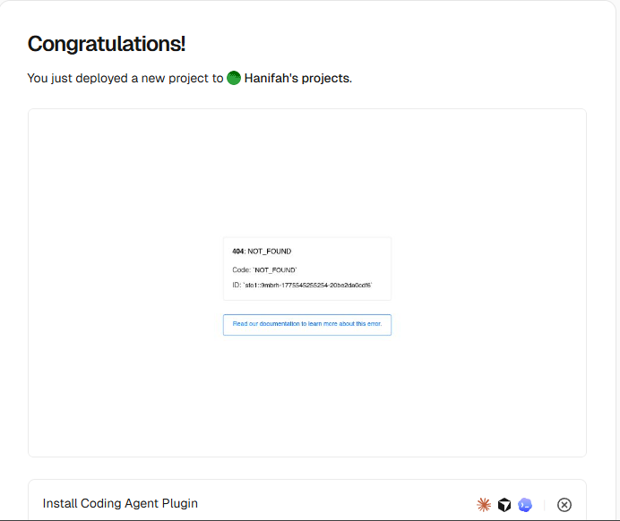
PRAKTIKUM 2 – Deployment ke Vercel
    C. Mengatasi Error Saat Deployment
    Masalah: Static Site Generation Gagal
        - Hapus file static.tsx
            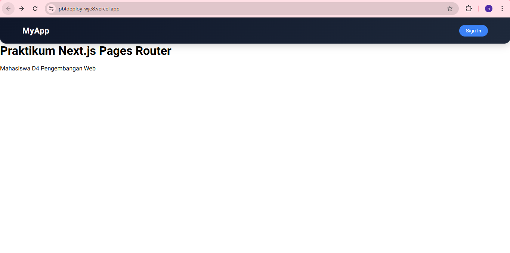
        - Comment pada line 46 pada file [produk].tsx yang berhubungan dengan static-site
        generation dicomment semua
    Solusi
        Gunakan SSR (Server Side Rendering)
            - SSR yang sebelumnya di comment dibuka commentnya pada file [produk].tsx
                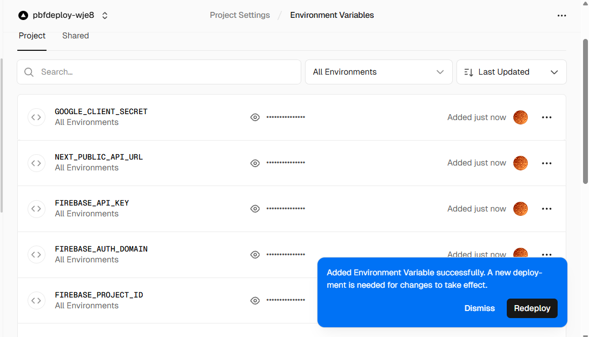
        Gunakan Environment Variable
            • Buat di .env.local:
                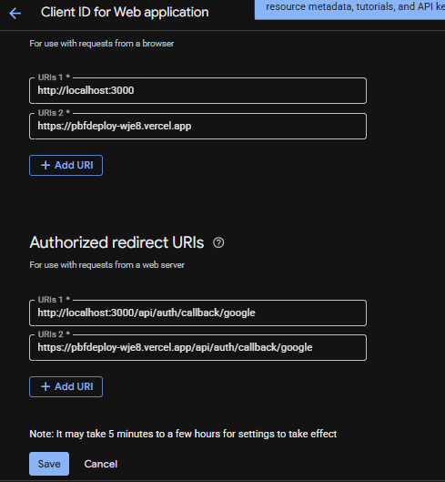
            o NEXT_PUBLIC_API_URL=http://localhost:3000
            • Ganti semua hardcoded URL:
                o pada file [produk].tsx
                    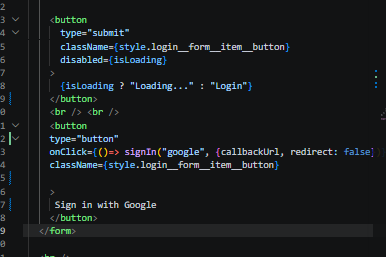
                o pada file server.tsx
                    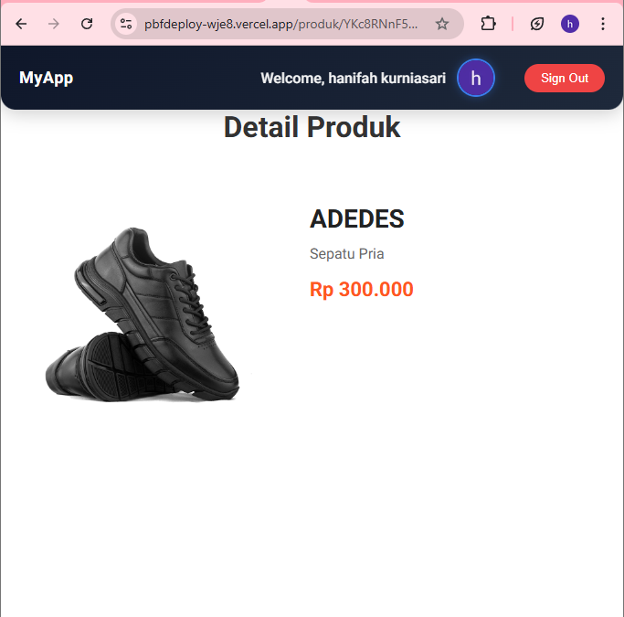
            Deploy berhasil
            
PRAKTIKUM 3 – Menambahkan Environment Variable di Vercel
    
PRAKTIKUM 4 – Konfigurasi Google OAuth Production
    
    
PRAKTIKUM 5 – Pengujian Setelah Deployment
    Coba akses:
    • /
    • /about
        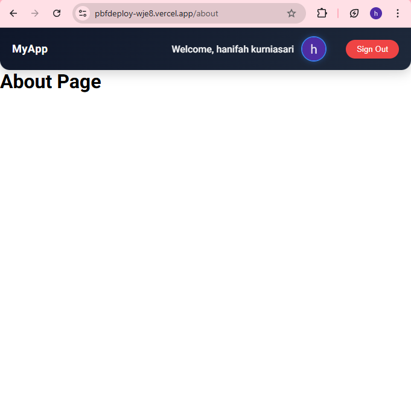
    • /product
        
    • /profile
        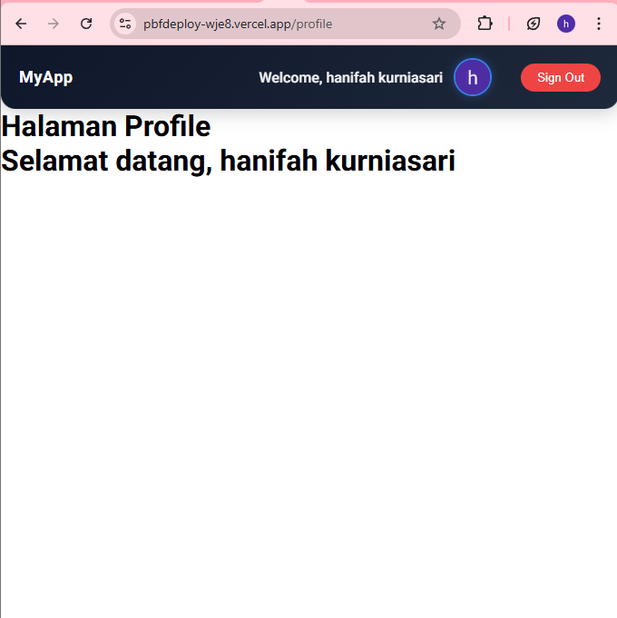
    • Login Google
        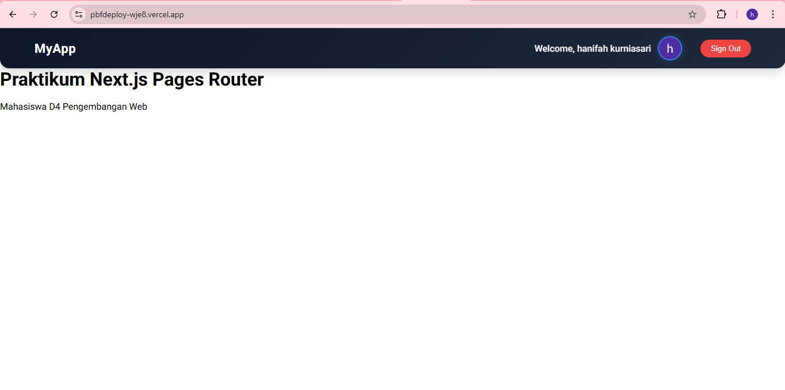
    • Login credential biasa
        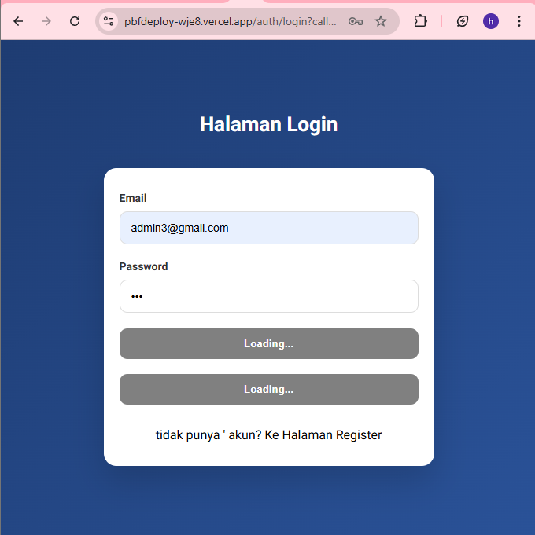
        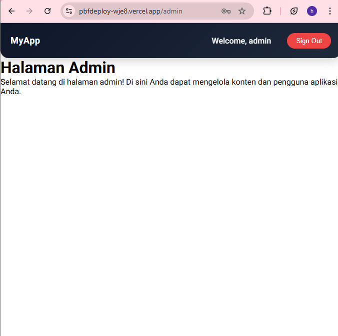
    Pastikan:
    • SSR berjalan
    • API tidak lagi localhost
    • Database terkoneksi
    • Google login berhasil

Refleksi & Diskusi
1. Mengapa localhost tidak boleh digunakan di production?
Localhost tidak boleh digunakan di production karena hanya bisa diakses dari komputer sendiri. User lain tidak bisa membuka aplikasi jika masih menggunakan localhost, sehingga harus menggunakan domain atau server publik.
2. Mengapa SSG bisa gagal saat build?
SSG bisa gagal saat build karena proses pengambilan data dilakukan saat build. Jika API error, data tidak tersedia, atau ada kesalahan kode, maka proses build akan gagal.
3. Apa perbedaan SSR dan SSG saat deployment?
SSR membuat halaman setiap ada request dari user sehingga membutuhkan server aktif, sedangkan SSG membuat halaman saat build menjadi file statis sehingga lebih cepat saat diakses.
4. Mengapa perlu redeploy setelah menambahkan environment?
Perlu redeploy karena environment variable hanya dibaca saat proses build. Jika tidak redeploy, perubahan tidak akan diterapkan pada aplikasi.
5. Apa fungsi redirect URI pada OAuth?
Redirect URI berfungsi untuk mengarahkan user kembali ke aplikasi setelah login dan membawa data autentikasi seperti token atau kode otorisasi.